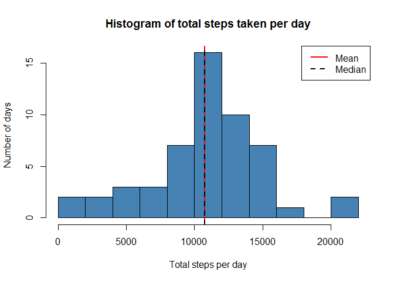
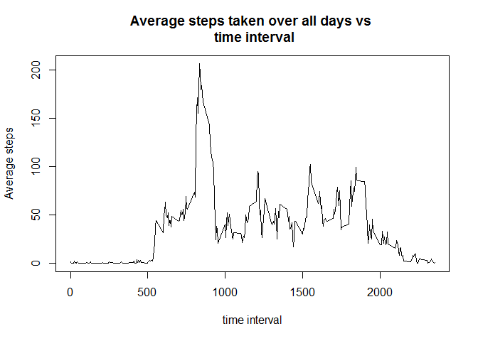
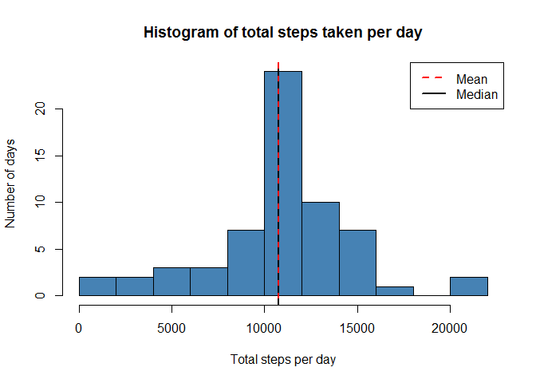
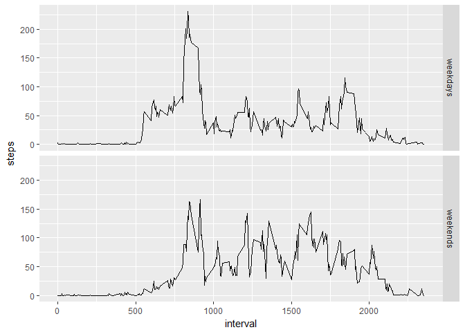

knitr::opts_chunk$set(echo = TRUE)


## 1. Loading and preprocessing the data

Set the working directory , download the data and unzip into the folder
```
setwd("D:/OneDrive/Public/Data Science/Course 5/RepData_PeerAssessment1")
url <- "https://d396qusza40orc.cloudfront.net/repdata%2Fdata%2Factivity.zip"
destfile <- "dataset.zip"
download.file(url, destfile)
unzip(destfile)
```

Read the csv file
```
activity <- read.csv("activity.csv", sep = ",")
```

The variable names and the structure and get the names of an object


```r
names(activity)
```

```
## [1] "steps"    "date"     "interval"
```

```r
str(activity)
```

```
## 'data.frame':	17568 obs. of  3 variables:
##  $ steps   : int  NA NA NA NA NA NA NA NA NA NA ...
##  $ date    : Factor w/ 61 levels "2012-10-01","2012-10-02",..: 1 1 1 1 1 1 1 1 1 1 ...
##  $ interval: int  0 5 10 15 20 25 30 35 40 45 ...
```


```r
summary(activity)
```

```
##      steps                date          interval     
##  Min.   :  0.00   2012-10-01:  288   Min.   :   0.0  
##  1st Qu.:  0.00   2012-10-02:  288   1st Qu.: 588.8  
##  Median :  0.00   2012-10-03:  288   Median :1177.5  
##  Mean   : 37.38   2012-10-04:  288   Mean   :1177.5  
##  3rd Qu.: 12.00   2012-10-05:  288   3rd Qu.:1766.2  
##  Max.   :806.00   2012-10-06:  288   Max.   :2355.0  
##  NA's   :2304     (Other)   :15840
```

```r
head(activity[which(!is.na(activity$steps)), ])
```

```
##     steps       date interval
## 289     0 2012-10-02        0
## 290     0 2012-10-02        5
## 291     0 2012-10-02       10
## 292     0 2012-10-02       15
## 293     0 2012-10-02       20
## 294     0 2012-10-02       25
```

## 2. Mean of "total number of step taken per day" over all days

Group the number of steps by date and interval


```r
library(reshape2)
activity_melt <- melt(activity[which(!is.na(activity$steps)), ], id.vars = c("date", "interval"))
head(activity_melt)
```

```
##         date interval variable value
## 1 2012-10-02        0    steps     0
## 2 2012-10-02        5    steps     0
## 3 2012-10-02       10    steps     0
## 4 2012-10-02       15    steps     0
## 5 2012-10-02       20    steps     0
## 6 2012-10-02       25    steps     0
```

```r
steps_sum <- dcast(activity_melt, date ~ variable, sum)
head(steps_sum)
```

```
##         date steps
## 1 2012-10-02   126
## 2 2012-10-03 11352
## 3 2012-10-04 12116
## 4 2012-10-05 13294
## 5 2012-10-06 15420
## 6 2012-10-07 11015
```

Total number of steps per day

```r
summary(steps_sum$steps) # Summary of data
```

```
##    Min. 1st Qu.  Median    Mean 3rd Qu.    Max. 
##      41    8841   10765   10766   13294   21194
```

Histogram of total number of steps taken sans NA rows. Also, showing mean and median of the data.


```r
hist(steps_sum$steps, main = "Histogram of total steps taken per day", 
     xlab = "Total steps per day", ylab = "Number of days", 
     breaks = 10, col = "steel blue")
abline(v = mean(steps_sum$steps), lty = 1, lwd = 2, col = "red")
abline(v = median(steps_sum$steps), lty = 2, lwd = 2, col = "black")
legend(x = "topright", c("Mean", "Median"), col = c("red", "black"), 
       lty = c(1, 2), lwd = c(2, 2))
```

<!-- -->

## 3. What is the average daily activity pattern?

Make a time series plot


```r
stepsmeaninterval <- dcast(activity_melt, interval ~ variable, 
                           mean, na.rm = TRUE)
head(stepsmeaninterval)
```

```
##   interval     steps
## 1        0 1.7169811
## 2        5 0.3396226
## 3       10 0.1320755
## 4       15 0.1509434
## 5       20 0.0754717
## 6       25 2.0943396
```

```r
plot(stepsmeaninterval$interval, stepsmeaninterval$steps, ty = "l",
     xlab = "time interval", ylab = "Average steps", 
     main = "Average steps taken over all days vs \n time interval")
```

<!-- -->
Time interval during which the maximum number of steps


```r
maxsteps_interval <- 
        stepsmeaninterval$interval[which.max(stepsmeaninterval$steps)]
maxsteps_interval
```

```
## [1] 835
```

## 4. Imputing missing values

Replace the missing data for a day by the time average over all other days


```r
activity2 <- split(activity, activity$interval)
activity2 <- lapply(activity2, function(x) {
        x$steps[which(is.na(x$steps))] <- mean(x$steps, na.rm = TRUE)
        return(x)
})
activity2 <- do.call("rbind", activity2)
row.names(activity2) <- NULL

activity2 <- split(activity2, activity2$date)
df <- lapply(activity2, function(x) {
        x$steps[which(is.na(x$steps))] <- mean(x$steps, na.rm = TRUE)
        return(x)
})
activity2 <- do.call("rbind", activity2)
row.names(activity2) <- NULL
head(activity2)
```

```
##       steps       date interval
## 1 1.7169811 2012-10-01        0
## 2 0.3396226 2012-10-01        5
## 3 0.1320755 2012-10-01       10
## 4 0.1509434 2012-10-01       15
## 5 0.0754717 2012-10-01       20
## 6 2.0943396 2012-10-01       25
```

Refutes the intervals being disjoint

```r
library(reshape2)
activity_melt2 <- melt(activity2, id.vars = c("date", "interval"))
steps_sum <- dcast(activity_melt2, date ~ variable, sum, na.rm = TRUE)
head(steps_sum)
```

```
##         date    steps
## 1 2012-10-01 10766.19
## 2 2012-10-02   126.00
## 3 2012-10-03 11352.00
## 4 2012-10-04 12116.00
## 5 2012-10-05 13294.00
## 6 2012-10-06 15420.00
```

Histogram of total number of steps taken with imputed missing values

```r
hist(steps_sum$steps, main = "Histogram of total steps taken per day", 
     xlab = "Total steps per day", ylab = "Number of days", 
     breaks = 10, col = "steel blue")
abline(v = mean(steps_sum$steps), lty = 1, lwd = 2, col = "red")
abline(v = median(steps_sum$steps), lty = 2, lwd = 2, col = "black")
legend(x = "topright", c("Mean", "Median"), col = c("red", "black"), 
       lty = c(2, 1), lwd = c(2, 2))
```

<!-- -->

Number of rows with NA values

```r
sum(is.na(activity$steps))
```

```
## [1] 2304
```

```r
sum(is.na(activity$steps))*100/nrow(activity) # Percentage of rows
```

```
## [1] 13.11475
```

## 5. Are there differences in activity patterns between weekdays and weekends?

Create a new column for the date is a weekday or weekend.

```r
library(lubridate)
weekends <- which(weekdays(as.Date(activity2$date)) == "Saturday" |
                          weekdays(as.Date(activity2$date)) == "Sunday")
weekdays <- which(weekdays(as.Date(activity2$date)) != "Saturday" &
                          weekdays(as.Date(activity2$date)) != "Sunday")
temp <- c(rep("a", length(activity2)))
temp[weekends] <- "weekend"
temp[weekdays] <- "weekday"
length(temp)
```

```
## [1] 17568
```

```r
activity2 <- cbind(activity2, temp)
head(activity2)
```

```
##       steps       date interval    temp
## 1 1.7169811 2012-10-01        0 weekday
## 2 0.3396226 2012-10-01        5 weekday
## 3 0.1320755 2012-10-01       10 weekday
## 4 0.1509434 2012-10-01       15 weekday
## 5 0.0754717 2012-10-01       20 weekday
## 6 2.0943396 2012-10-01       25 weekday
```

```r
names(activity2)[4] <- "day"
```

Steps taken over each interval averaged across weekday days and weekend days
```
activity2split <- split(activity2, activity2$day)
stepsmean_interval <- lapply(activity2split, function(x) {
        temp <- aggregate(x$steps, list(x$interval), mean)
        names(temp) <- c("interval", "steps")
        return(temp)
})
```

Unsplit stepsmean_interval
```
stepsmean_interval <- do.call("rbind", stepsmean_interval)
weekdays <- grep("weekday" ,row.names(stepsmean_interval))
weekends <- grep("weekend" ,row.names(stepsmean_interval))
temp <- c(rep("a", length(stepsmean_interval$steps)))
temp[weekdays] <- "weekdays"
temp[weekends] <- "weekends"
names(temp) <- "day"
stepsmean_interval <- cbind(stepsmean_interval, temp)
row.names(stepsmean_interval) <- NULL
```

The mean number of steps taken over the weekdays and weekends.

```r
head(stepsmean_interval)
```

```
##   interval      steps     temp
## 1        0 2.25115304 weekdays
## 2        5 0.44528302 weekdays
## 3       10 0.17316562 weekdays
## 4       15 0.19790356 weekdays
## 5       20 0.09895178 weekdays
## 6       25 1.59035639 weekdays
```

Plot the graph

```r
library(ggplot2)
ggplot(stepsmean_interval, aes(interval, steps)) + geom_line() + facet_grid(temp ~ .) 
```

<!-- -->
